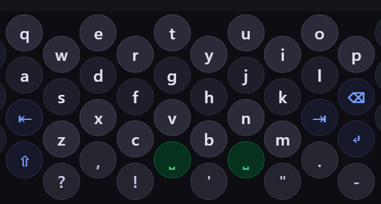

# Hexboard

An Android keyboard built around circular keys in a hexagonal tessellation.

## What it is, and why

Hexboard is plain QWERTY with one change: the rows zig-zag. Odd columns sit half a key
lower than even columns, which packs the keys into a hexagonal grid instead of a
rectangular one. Hexagonal packing fits more area into the same space, so every key is
bigger than it would be on a conventional layout of the same size. The letters stay
exactly where you expect them — you give up straight rows, and you get larger keys in
exchange.

The keys are drawn as **circles**, and that is the part that matters most.

Several keyboards already use hexagonal tessellation — Typewise, MessagEase, Thumb-Key —
and they draw the keys as hexagons, corners and all. Hexboard's claim is about
perception, not routing: a person aiming at a circle aims more confidently than a person
aiming at a shape with visible corners, so they aim closer to the centre, and their taps
land more accurately as a result. A corner is a place your eye can aim at that isn't the
middle of the key.

That is a claim about people, so it is testable rather than proven. If it turned out that
the effect wasn't there, or was too small to matter, the idea wouldn't survive it. It is
worth being precise about what is *not* being claimed: hex-shaped keyboards do not
mis-route taps, and Hexboard doesn't say they do. The difference is in where you aim, not
in what the software does with the tap.

## Status

In development, and honestly early. There is **no working keyboard yet** — the Android
app is a fresh Kotlin / Jetpack Compose build that doesn't type anything so far. There's
nothing to install.

## Try the prototype

`hexboard17.html` is a browser prototype. Download or clone the repo and open that file in
any browser — no build step, no dependencies. It's the only part of Hexboard you can
actually use today.

It demonstrates the layout, the swipe gestures between panels, and the full key inventory:
three letter panels (RARE / QWERTY / SYMBOLS) reached by swiping horizontally, emoji
panels by swiping down, and long-press accents on letters that need them.

The prototype is **frozen** — a reference for what the design intends, not the product and
not a maintained app. The real key data now lives in
[`resources/key-layout.json`](resources/key-layout.json), which the Android build reads.

## The planning record is public on purpose

[`LOG/`](LOG/) and [`QUEUE.md`](QUEUE.md) are the working record of how this project is
being designed — every session, every decision, and the reasoning behind each one,
including the ideas that were considered and rejected.

They're tracked in this repo deliberately. Hexboard is built using
[Throughliner](https://flintcraft.tech), a method for building software with Claude Code,
and this repo is a worked example of it: a real project with the planning left in rather
than tidied away. If you're more interested in how software gets decided than in how it
gets typed, start there.

## Licence

Hexboard is source-available under the [PolyForm Noncommercial License 1.0.0](LICENSE).

In plain terms:

- **You may read the source.** It's here to be read.
- **You may fork it to build Hexboard for another language or key set.** That's an explicitly welcome use, and the key inventory lives in `resources/key-layout.json` precisely so it can be varied without touching the code.
- **You may not use it commercially.** Selling Hexboard, or anything built from it, is not permitted. Personal use, hobby projects, study, and use by charities, schools, and public institutions all are.

Source-available is not the same as open source: this licence restricts commercial use, so Hexboard does not qualify as open source under the OSI definition. That restriction is deliberate.

The licence text in [LICENSE](LICENSE) is the authoritative version; this summary is not a substitute for it.
